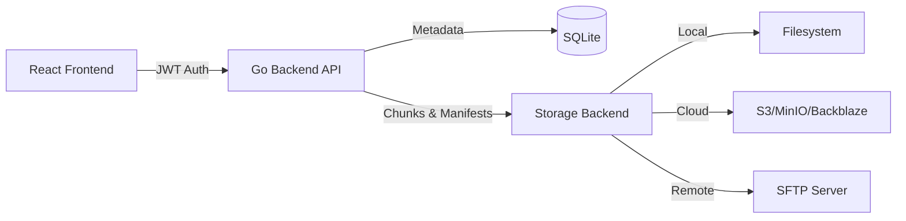

<div align="center">

# SaveSync

### Modern Deduplicating Backup Solution

A production-ready backup system with content-defined chunking, multi-user authentication, and multiple storage backends.

[](LICENSE)
[](https://go.dev/)
[](https://react.dev/)
[](https://www.docker.com/)

[Features](#features) • [Quick Start](#quick-start) • [Storage](#storage-backends)

</div>

---

## ✨ Features

### Core Capabilities
- 🔐 **Multi-User Authentication** - JWT-based auth with bcrypt password hashing
- 🧩 **Content-Defined Chunking** - Efficient deduplication using rolling hash (CDC)
- 💾 **Multiple Storage Backends** - Local filesystem, S3-compatible, and SFTP
- 📸 **Snapshot Management** - Browse file trees, restore data, download manifests
- ⏰ **Flexible Scheduling** - Manual, hourly, daily, weekly, or custom cron expressions

### User Experience
- 🎨 **Modern Web UI** - Clean React interface with dark/light mode support
- 📁 **File Explorer** - Navigate directories and browse snapshot content
- 📊 **Real-time Status** - Live job monitoring and progress tracking
- 🔒 **Secure by Default** - Per-user data isolation and protected API endpoints

---

## Architecture



**Tech Stack:**
- **Backend**: Go 1.24+, Chi router, SQLite, Zap logging, Prometheus metrics
- **Frontend**: React 18 + TypeScript, Vite, shadcn/ui, Tailwind CSS, React Query, Zustand
- **Auth**: JWT tokens (HS256) + bcrypt password hashing
- **API**: RESTful with Swagger/OpenAPI documentation

---

## Quick Start

### Prerequisites
- Docker & Docker Compose **OR**
- Go 1.24+ and Node.js 20+

### Option 1: Docker Compose (Recommended)

```bash
# Clone repository
git clone https://github.com/axelfrache/savesync.git
cd savesync

# Start services
docker compose up -d

# Access the application
# Frontend: http://localhost:5173
# Backend:  http://localhost:8080
# Swagger:  http://localhost:8080/swagger/index.html

# Default credentials
# Email:    admin@savesync.local
# Password: admin123
```

### Option 2: Manual Setup

<details>
<summary><b>Backend Setup</b></summary>

```bash
cd backend
go mod download
swag init -g cmd/savesyncd/main.go
go run cmd/savesyncd/main.go
```

</details>

<details>
<summary><b>Frontend Setup</b></summary>

```bash
cd frontend
pnpm install
pnpm dev
```

</details>

---

## Storage Backends

| Backend | Use Case | Configuration |
|---------|----------|---------------|
| **Local** | On-premise backups | `path` - Local directory path |
| **S3** | Cloud storage | `bucket`, `region`, `access_key`, `secret_key`, `endpoint` |
| **SFTP** | Remote servers | `host`, `port`, `user`, `password` or `key_path`, `path` |

**Supported S3 Providers:** AWS S3, MinIO, Backblaze B2, DigitalOcean Spaces

---

## Documentation

- **API Documentation**: Available at `/swagger/index.html` when running

---

## Configuration

### Environment Variables

**Backend:**
```bash
PORT=8080                       # HTTP server port
DB_PATH=./data/savesync.db      # SQLite database location
DATA_DIR=./data                 # Local storage directory
LOG_LEVEL=info                  # Logging level (debug, info, warn, error)
JWT_SECRET=change-me            # JWT signing secret (change in production!)
```

**Frontend:**
```bash
VITE_API_URL=http://localhost:8080   # Backend API URL
```

---

## Testing

```bash
# Backend tests with coverage
cd backend
go test -v -coverprofile=coverage.out ./...
go tool cover -html=coverage.out

# Specific package tests
go test -v ./internal/app/backupservice/...
```

**CI/CD:** GitHub Actions automatically runs tests and builds Docker images on push.

## License

This project is licensed under the **MIT License** - see the [LICENSE](LICENSE) file for details.

---

## Acknowledgments

Built with excellent open-source tools:
- [Go](https://golang.org/) - Backend
- [React](https://react.dev/) - Frontend
- [shadcn/ui](https://ui.shadcn.com/) - UI components
- [Tailwind CSS](https://tailwindcss.com/) - Styling
- [Chi](https://go-chi.io/) - HTTP router
- [Zap](https://github.com/uber-go/zap) - Logging

---

<div align="center">

**[Report Bug](https://github.com/axelfrache/savesync/issues) • [Request Feature](https://github.com/axelfrache/savesync/issues)**

Made with ❤️ for the open-source community

</div>
