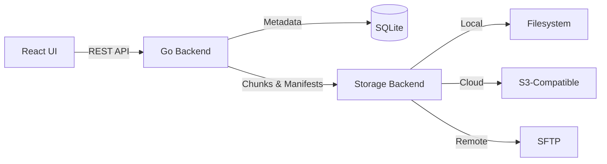

<div align="center">

# SaveSync

### Modern Deduplicating Backup Solution

A production-ready backup system with content-defined chunking (CDC), multiple storage backends, and a beautiful web interface.

[](LICENSE)
[](https://go.dev/)
[](https://react.dev/)
[](https://www.docker.com/)

[Features](#features) • [Quick Start](#quick-start) • [Documentation](#api-documentation) • [Contributing](#contributing)

</div>

---

## Overview

SaveSync combines enterprise-grade backup capabilities with an intuitive web interface. Built for reliability and efficiency, it uses content-defined chunking for optimal storage deduplication across local, cloud, and remote storage backends.

## Features

<table>
<tr>
<td width="50%">

### Core Capabilities
- **Content-Defined Chunking (CDC)** - Efficient deduplication using rolling hash
- **Multi-Backend Support** - Local, S3, and SFTP storage
- **Snapshot Management** - Browse, restore, and download snapshots
- **Flexible Scheduling** - Manual, hourly, daily, weekly, or cron-based

</td>
<td width="50%">

### User Experience
- **Modern Web UI** - Clean, responsive React interface
- **Dark/Light Modes** - Seamless theme switching
- **Real-time Updates** - Live job status and progress
- **File Explorer** - Browse backed-up files in tree view

</td>
</tr>
</table>

## Architecture



<details>
<summary><b>Technology Stack</b></summary>

### Backend
- **Language**: Go 1.24+
- **Router**: Chi (lightweight, idiomatic)
- **Database**: SQLite with modernc.org driver
- **Logging**: Zap (structured, high-performance)
- **Metrics**: Prometheus integration
- **API Docs**: Swagger/OpenAPI

### Frontend
- **Framework**: React 18 + TypeScript
- **Build Tool**: Vite (fast, modern)
- **UI Library**: shadcn/ui + Tailwind CSS
- **State**: React Query + Zustand
- **Routing**: React Router v6
- **Icons**: Lucide React

</details>

---

## Quick Start

### Docker Compose (Recommended)

```bash
# Clone and start
git clone https://github.com/axelfrache/savesync.git
cd savesync
docker compose up -d
```

**Access Points:**
- **Frontend**: http://localhost:5173
- **Backend API**: http://localhost:8080/api
- **Swagger Docs**: http://localhost:8080/swagger/index.html

### Manual Setup

<details>
<summary><b>Backend</b></summary>

```bash
cd backend
go mod download
swag init -g cmd/savesyncd/main.go
go run cmd/savesyncd/main.go
```

</details>

<details>
<summary><b>Frontend</b></summary>

```bash
cd frontend
pnpm install
pnpm dev
```

</details>

---

## Storage Backends

| Backend | Use Case | Configuration |
|---------|----------|---------------|
| **Local** | On-premise backups | `path` - Filesystem directory |
| **S3** | Cloud storage (AWS, MinIO, Backblaze) | `bucket`, `region`, `access_key`, `secret_key`, `endpoint` |
| **SFTP** | Remote server backups | `host`, `port`, `user`, `password` or `key_path`, `path` |

---

## API Documentation

Interactive Swagger UI available at `/swagger/index.html` when running the backend.

**Regenerate docs:**
```bash
cd backend
swag init -g cmd/savesyncd/main.go
```

---

## Configuration

### Environment Variables

**Backend:**
```bash
PORT=8080                          # HTTP server port
DB_PATH=./data/savesync.db         # SQLite database path
DATA_DIR=./data                    # Local storage directory
LOG_LEVEL=info                     # debug, info, warn, error
```

**Frontend:**
```bash
VITE_API_URL=http://localhost:8080/api
```

---

## Testing

### Backend Tests
```bash
cd backend

# All tests with coverage
go test -v -coverprofile=coverage.out ./...
go tool cover -html=coverage.out

# Specific package
go test -v ./internal/app/backupservice/...
```

### CI/CD Pipeline

GitHub Actions workflow automates:
- Backend unit tests
- Swagger documentation generation
- Docker image builds (backend + frontend)

---

## Project Structure

```
savesync/
├── backend/
│   ├── cmd/savesyncd/              # Main application entry
│   ├── internal/
│   │   ├── app/                    # Business logic (services)
│   │   ├── domain/                 # Models, interfaces, errors
│   │   └── infra/                  # Infrastructure layer
│   │       ├── backends/           # Storage implementations
│   │       ├── db/                 # Database & repositories
│   │       ├── http/               # HTTP handlers & routes
│   │       └── observability/      # Metrics & logging
│   └── docs/                       # Swagger docs (generated)
├── frontend/
│   ├── src/
│   │   ├── components/
│   │   │   ├── features/           # Feature-specific components
│   │   │   ├── layout/             # Layout components
│   │   │   ├── shared/             # Shared components
│   │   │   └── ui/                 # shadcn/ui primitives
│   │   ├── hooks/                  # React Query hooks
│   │   ├── pages/                  # Route pages
│   │   ├── lib/                    # API client & utilities
│   │   └── store/                  # Zustand stores
│   └── public/                     # Static assets
└── docker-compose.yml              # Container orchestration
```

---

## Development

### Prerequisites
- **Go** 1.24+
- **Node.js** 20+
- **pnpm** (package manager)
- **Docker** & Docker Compose (optional)

### Building for Production

```bash
# Docker Compose
docker compose build

# Manual builds
cd backend && go build -o savesyncd cmd/savesyncd/main.go
cd frontend && pnpm build
```

---

## Contributing

Contributions are welcome! Whether it's bug fixes, features, or documentation improvements.

### How to Contribute

1. **Fork** the repository
2. **Create** a feature branch (`git checkout -b feature/amazing-feature`)
3. **Commit** your changes (`git commit -m 'Add amazing feature'`)
4. **Push** to the branch (`git push origin feature/amazing-feature`)
5. **Open** a Pull Request

### Development Tips
- Run tests before submitting PRs
- Follow existing code style
- Update documentation for new features
- Add tests for bug fixes

---

## License

This project is licensed under the **MIT License** - see the [LICENSE](LICENSE) file for details.

---

## Acknowledgments

Built with excellent open-source tools:
- [Go](https://golang.org/) - Backend language
- [React](https://react.dev/) - Frontend framework
- [shadcn/ui](https://ui.shadcn.com/) - UI components
- [Tailwind CSS](https://tailwindcss.com/) - Styling
- [Lucide](https://lucide.dev/) - Icons
- [Chi](https://go-chi.io/) - HTTP router
- [Zap](https://github.com/uber-go/zap) - Structured logging

---

<div align="center">

**[Documentation](docs/) • [Report Bug](https://github.com/axelfrache/savesync/issues) • [Request Feature](https://github.com/axelfrache/savesync/issues)**

Made with care for the open-source community

</div>
